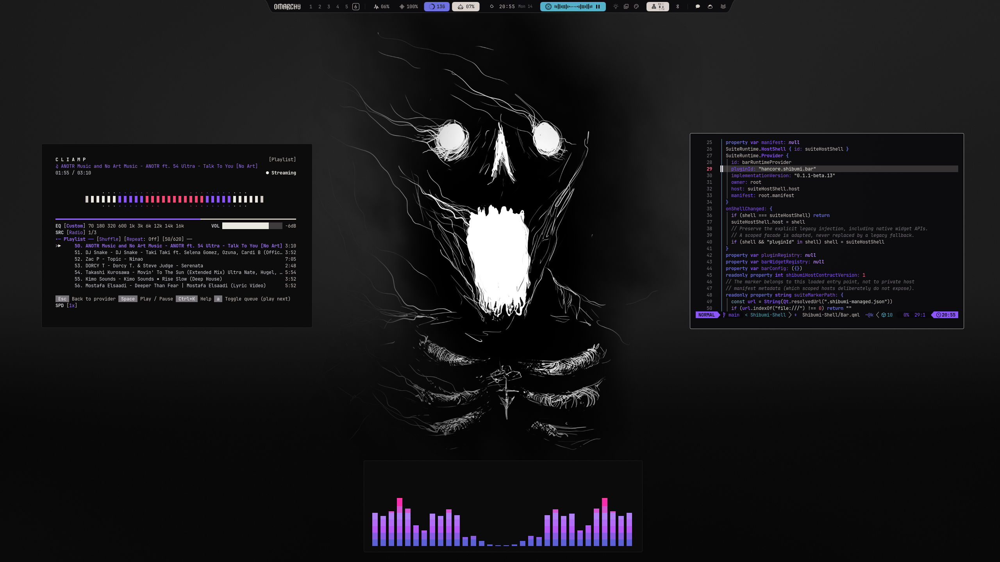

# Banish

# Installation Theme

To install this theme, simply use the omarchy-theme-install command:

```bash
omarchy-theme-install https://github.com/HANCORE-linux/omarchy-banish-theme.git
```

Omarchy skips every `.lua` in a theme installed from a repo, so this way leaves out
`gum_env.lua` and `hyprland.lua`. Clone and link instead to get the whole theme:

```bash
git clone https://github.com/HANCORE-linux/omarchy-banish-theme.git ~/omarchy-banish-theme
ln -s ~/omarchy-banish-theme ~/.config/omarchy/themes/banish
omarchy theme set banish
```

## Enable shell plugins

The custom menu, OSD and notification plugins are optional. After installing the
theme, link them once:

```bash
mkdir -p ~/.config/omarchy/plugins
for plugin in banish.menu banish.osd banish.notifications; do
  ln -sfnT "$HOME/.config/omarchy/themes/banish/shell-plugins/$plugin" \
    "$HOME/.config/omarchy/plugins/$plugin"
done
omarchy-shell shell rescanPlugins
```

Then activate them to replace the built-in components:

```bash
omarchy plugin enable banish.menu
omarchy plugin enable banish.osd
omarchy plugin enable banish.notifications
omarchy restart shell
```

## Remove shell plugins

To restore Omarchy's built-in menu, OSD and notifications:

```bash
for plugin in banish.menu banish.osd banish.notifications; do
  omarchy plugin disable "$plugin" &&
    omarchy plugin remove "$plugin" --yes
done

omarchy restart shell
```

For symlinked plugins, the files in the theme folder are kept.



#### Quickshell-Bar
[LINK](https://github.com/HANCORE-linux/Shibumi-Shell)

#### Theme-Hook-Manager
[Link](https://github.com/OldJobobo/theme-hook-plugin-manager)
