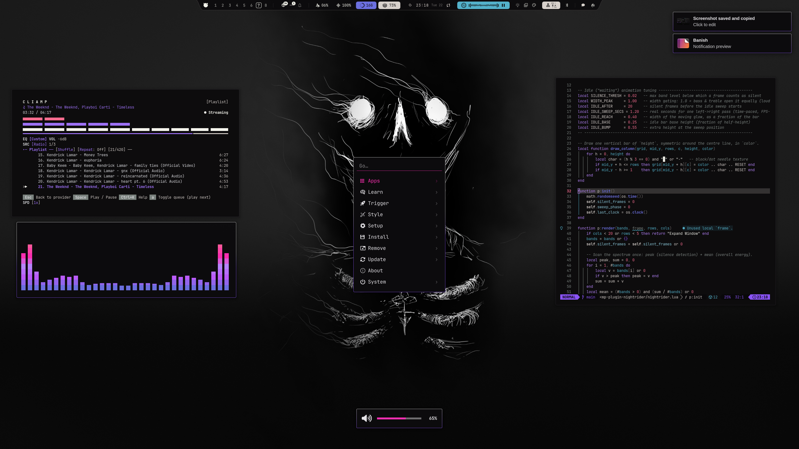

# Banish

# Installation Theme

To install this theme, simply use the omarchy-theme-install command:

```bash
omarchy-theme-install https://github.com/HANCORE-linux/omarchy-banish-theme.git
```

Omarchy skips every `.lua` in a theme installed from a repo, so this way leaves out
`gum_env.lua` and `hyprland.lua`. Clone and link instead to get the whole theme:

```bash
git clone https://github.com/HANCORE-linux/omarchy-banish-theme.git ~/omarchy-banish-theme
ln -s ~/omarchy-banish-theme ~/.config/omarchy/themes/banish
omarchy theme set banish
```

<details>
<summary>Enable Shell Plugins</summary>

The custom menu, OSD and notification plugins are optional. After installing the
theme, first link them (works from Bash, Zsh and Fish):

```bash
mkdir -p ~/.config/omarchy/plugins &&
ln -sfnT ~/.config/omarchy/themes/banish/shell-plugins/banish.menu ~/.config/omarchy/plugins/banish.menu &&
ln -sfnT ~/.config/omarchy/themes/banish/shell-plugins/banish.osd ~/.config/omarchy/plugins/banish.osd &&
ln -sfnT ~/.config/omarchy/themes/banish/shell-plugins/banish.notifications ~/.config/omarchy/plugins/banish.notifications &&
omarchy-shell shell rescanPlugins &&
echo "Plugins linked. Run the activation commands below."
```

**Then activate them:** linking alone does not enable the plugins. Each enable
command prints `Enabled banish.…` on success.

```bash
omarchy plugin enable banish.menu &&
omarchy plugin enable banish.osd &&
omarchy plugin enable banish.notifications &&
omarchy restart shell
```

</details>

<details>
<summary>Remove Shell Plugins</summary>

To restore Omarchy's built-in menu, OSD and notifications:

```bash
omarchy plugin disable banish.menu && omarchy plugin remove banish.menu --yes
omarchy plugin disable banish.osd && omarchy plugin remove banish.osd --yes
omarchy plugin disable banish.notifications && omarchy plugin remove banish.notifications --yes

omarchy restart shell
```

For symlinked plugins, the files in the theme folder are kept.

</details>




#### Quickshell-Bar
[LINK](https://github.com/HANCORE-linux/Shibumi-Shell)

#### Theme-Hook-Manager
[Link](https://github.com/OldJobobo/theme-hook-plugin-manager)
